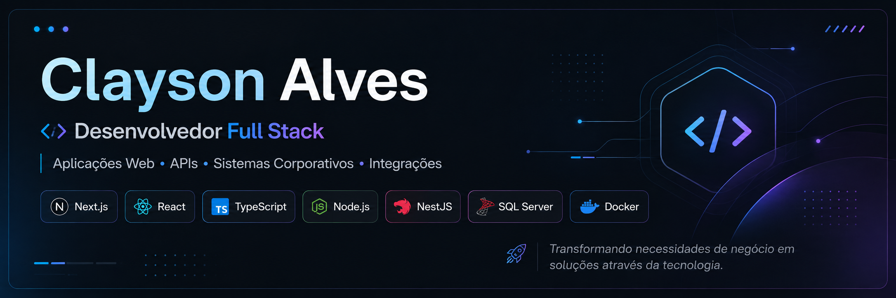

### Desenvolvedor Full Stack

**Aplicações Web • APIs • Sistemas Corporativos • Integrações**

Transformando necessidades de negócio em soluções através da tecnologia.

  
  
  

---

## 👨‍💻 Sobre mim

Sou **Desenvolvedor Full Stack** com experiência no desenvolvimento, manutenção e evolução de aplicações web, APIs e sistemas corporativos.

Atuo conectando diferentes camadas de uma aplicação — **frontend, backend, regras de negócio, autenticação, banco de dados e infraestrutura** — sempre buscando soluções organizadas, escaláveis e fáceis de manter.

### 💡 Experiência com

- Desenvolvimento de sistemas corporativos e administrativos
- Desenvolvimento e integração de APIs REST
- Implementação de regras de negócio
- Integração entre frontend, backend e banco de dados
- Autenticação, usuários, perfis e permissões
- Dashboards e ferramentas administrativas
- Consultas, procedures e manipulação de dados com SQL Server
- Integração entre sistemas e ERP
- Dockerização de aplicações
- Correção de bugs, manutenção e evolução de sistemas existentes

---

## 🚀 Stack Tecnológica

### 🎨 Frontend

### ⚙️ Backend

### 🗄️ Banco de Dados

### 🛠️ DevOps & Ferramentas

---

## 📌 Projetos em Destaque

### 🎫 [Sistema de Gestão de Chamados](https://github.com/claycode-dev/sistema-gestao-chamados)

Sistema Full Stack para abertura, acompanhamento e gerenciamento de chamados, com foco em organização de processos internos, usuários, responsáveis e controle de status.

**Stack prevista:** `Next.js` • `React` • `TypeScript` • `NestJS` • `SQL Server` • `Docker`

---

### 🚚 [Sistema de Gestão de Frotas](https://github.com/claycode-dev/gestao-frotas)

Plataforma para gerenciamento de veículos, viagens, custos e operações relacionadas à frota, explorando regras de negócio, dashboards e gerenciamento de dados.

**Stack prevista:** `Next.js` • `React` • `TypeScript` • `NestJS` • `SQL Server` • `Docker`

---

### 🔐 [Auth Service](https://github.com/claycode-dev/auth-service)

API voltada para autenticação, autorização, gerenciamento de usuários e controle de permissões em aplicações.

**Stack prevista:** `NestJS` • `TypeScript` • `JWT` • `SQL Server` • `Docker`

---

## 🎯 Atualmente

- 🚧 Desenvolvendo novos projetos para meu portfólio
- 📚 Aprimorando conhecimentos em arquitetura e desenvolvimento Full Stack
- 🔎 Criando aplicações com foco em organização, escalabilidade e boas práticas

---

## 📫 Contato

  
  

---

### 💻 Código é ferramenta. Resolver problemas é o objetivo.

